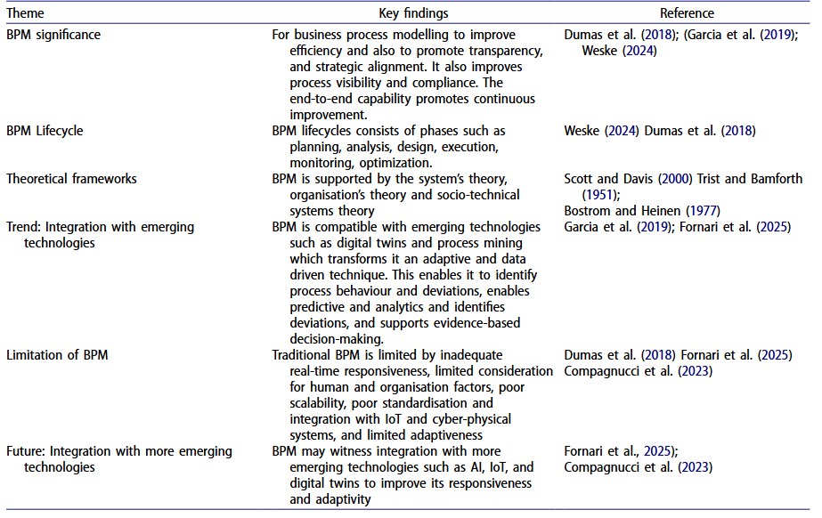
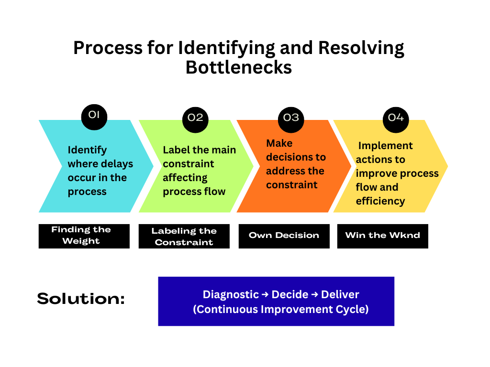
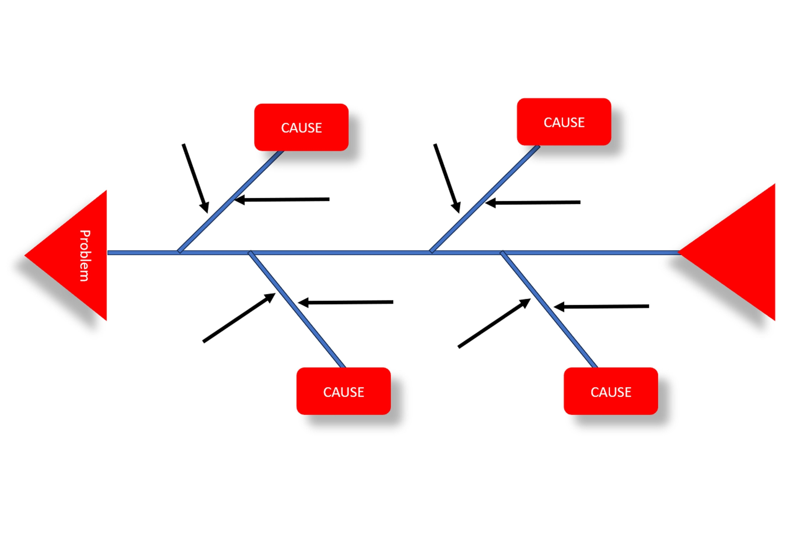
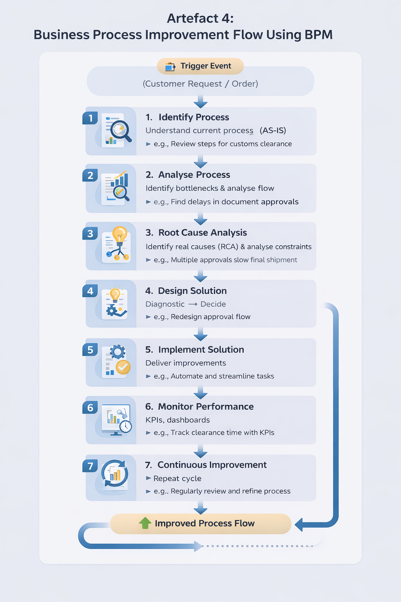

# COIT20252 Business Process Management
# E-Portfolio 1: Process Analysis
**Student Name:** Erika Macias Barragan  
**Student ID:** 12284869

## Artefact 1: BPM Frameworks for Process Improvement 
### Summary
This article provides a systematic review of business process management (BPM) frameworks and their applications for improving organisational performance. It analyses current BPM frameworks and examines how these facilitate process management, whilst also highlighting challenges such as process complexity and a lack of alignment with business objectives. It also explains how business process management (BPM) is evolving towards technology-driven approaches, enabling accurate analysis (Akinbowale et al., 2026, pp. 1–3, 13–15).

 
### Reflection 
I selected this article because it explains the importance of BPM as the foundation for improving and analysing processes. It helped me understand how BPM identifies inefficiencies and delays while supporting more accurate and reliable processes. In foreign trade operations, this is important because delays in documentation, customs clearance, and coordination between stakeholders can affect performance.
On the other hand, what was gained was knowledge and curiosity about digital twins creating real-time, simulation-ready models that allow processes to be monitored, predicted, and continuously improved using data-driven analysis.

## Artefact 2: Identifying and Managing Process Bottlenecks 
### Summary
This diagram maps out the strategy from the video, focusing on spotting delays and identifying what's holding the process back. By making informed choices and taking targeted action, we can smooth out the workflow and cut down on waste, which ultimately makes the whole operation run more effectively from start to finish.

### Reflection 
I have chosen this video to show that, even when a company has a strong team, delays in processes can still occur due to inefficient workflows. For example, requiring approvals from multiple people can slow down task completion and create bottlenecks. This reflects BPM concepts, where analysing flow helps identify where work is delayed and which constraints have the greatest impact on performance. It also highlights the importance of making timely decisions to resolve these issues. Additionally, continuous improvement is essential; the use of visual dashboards to monitor bottlenecks regularly supports ongoing optimisation. This aligns with the structured approach of Diagnostic, Decide, and Deliver as a continuous improvement cycle.

## Artefact 3: Root Cause Analysis Using Process Mining
### Summary 
This article reviews how companies use data to find the real reasons behind business problems. By combining process mining with root cause analysis, organizations can move from spotting delays to fixing their actual sources. While new AI helps, human expertise remains vital for solving complex issues and improving overall performance(Erdogan, 2025, p. 765, 767).

 
### Reflection
I have chosen this article because it shows how process mining has evolved. Previously, it was only used to map out how work is carried out, but now it is used to solve problems. By incorporating ‘root cause analysis’, it not only shows what went wrong, but also explains why it happened. A key point is that, even with new smart technologies (such as AI), we still need human experts to understand the data a view I support.
Finally, the article offers a plan for using data logs to identify and resolve the main issues that are holding a business back.

## Artefact 4: Business Process Improvement Flow Using BPM  
### Summary
This diagram presents a structured Business Process Management (BPM) approach to improving process performance. It shows how processes begin with identifying and analysing the current workflow, followed by detecting bottlenecks and conducting root cause analysis. Based on this, solutions are designed and implemented, and performance is monitored using KPIs and dashboards. The process is continuous, ensuring ongoing improvement and optimisation of workflow efficiency and organisational performance (ABPMP International, 2019).

### Reflection 
Their information helped me adopt a holistic view, rather than perceiving these as isolated problems that require separate solutions. This approach incorporates key concepts, such as flow analysis, the identification of bottlenecks, and root cause analysis, to support effective decision-making. For instance, in the field of psychology, information silos between departments can disrupt process flows and lead to inefficiencies in decision-making. This changed my understanding of how things work by demonstrating that process improvement depends on analysing the entire workflow, improving coordination and continuously monitoring performance to achieve long-term efficiency and reliability.

### References
- ABPMP International 2019, Guide to the Business Process Management Common Body of Knowledge (BPM CBOK®), Version 4.0, Association of Business Process Management Professionals.
- Akinbowale, O.E., Zerihun, M.F. and Mashigo, P., 2026. Business process management framework: systematic review of the trends, potentials and future. Cogent Business & Management, 13(1), p.2627025.
- Erdogan, T. (2025). Process Mining for Root Cause Analysis: A Systematic Literature Review. Iğdır Üniversitesi Fen Bilimleri Enstitüsü Dergisi. doi: 10.21597/jist.1594801.
- Jk Michaels Institute 2023, Process bottlenecks: Spot them fast (before they cost you weeks), YouTube, viewed 3 April 2026, https://www.youtube.com/watch?v=1WheGsEDjH4

## Evidence of Original Work Checklist

- [x] Personal reflections written in my own voice, demonstrating what I learned and how my understanding developed  
- [x] Examples tailored to my context, including foreign trade operations and psychology industry scenarios  
- [x] Annotations and explanations linking artefacts to Business Process Management (BPM) concepts  
- [x] Citations and references included to support analysis and academic claims  
- [x] Multimedia elements created, including process diagrams and visual representations  
- [ ] Screenshots or notes from my process (e.g., brainstorming or mind maps)

