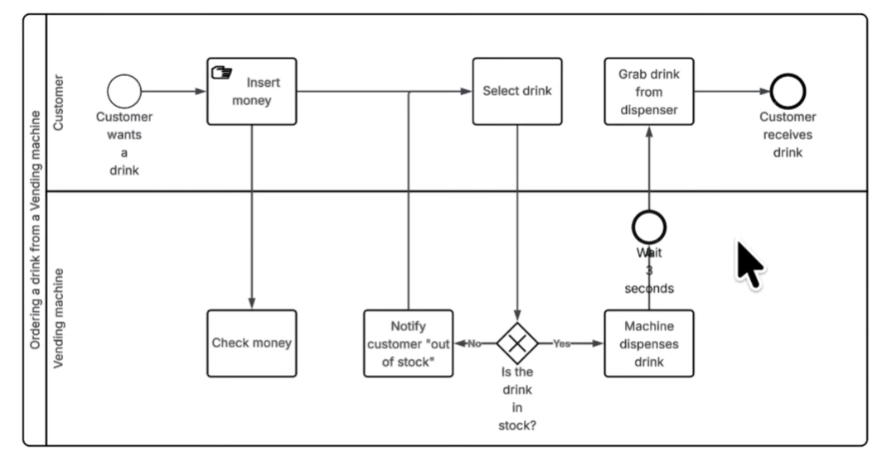
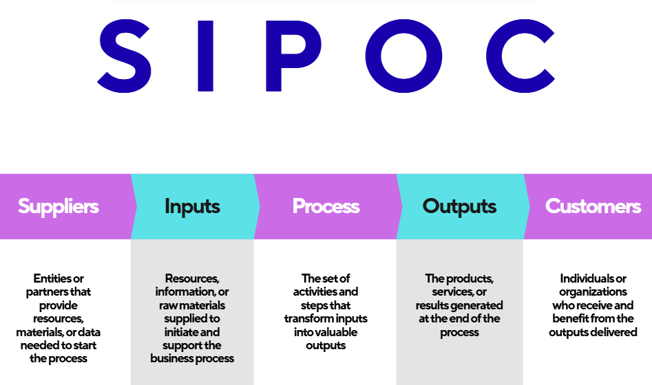
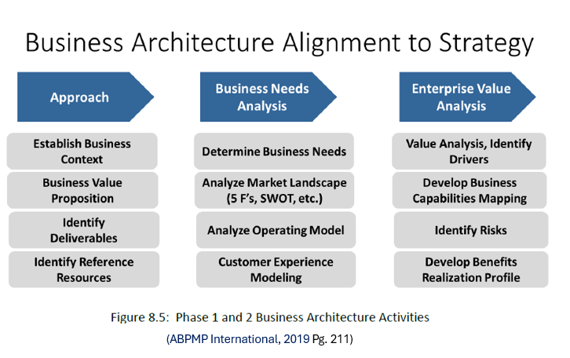
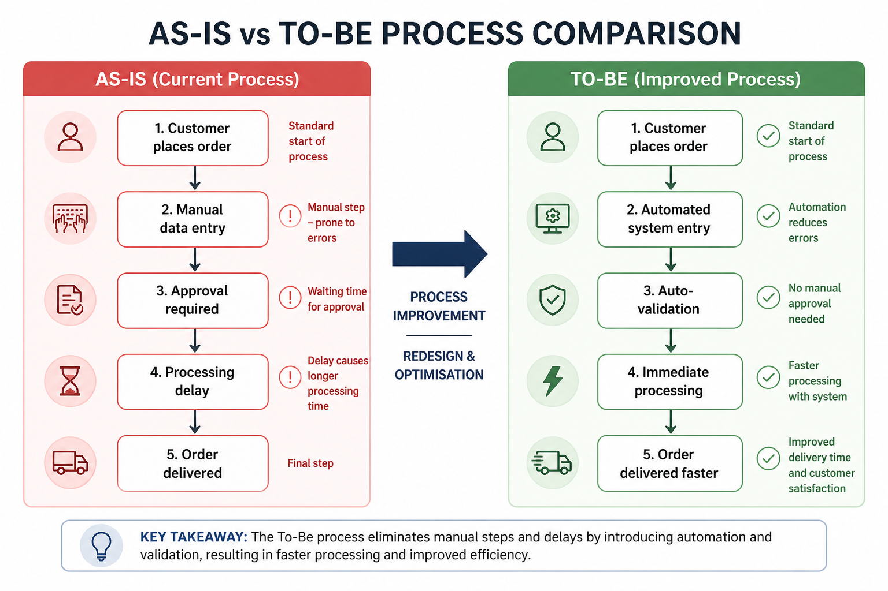

# COIT20252 Business Process Management
# E-Portfolio 2: Business Process Modelling
**Student Name:** Erika Macias Barragan  
**Student ID:** 12284869

## Artefact 1: BPMN diagram tutorial (Video)
**Description**
This resource is a video tutorial on BPMN (Business Process Model and Notation) developed by Lucid Software. This video explains how to create business process diagrams using standard BPMN symbols, showing how these elements represent the sequence of activities and decision points within a process. It provides a clear visual method that helps users understand how a process works from start to finish, enabling them to make informed decisions(Lucid Software, 2025). 

*Figure 1: BPMN tutorial showing key modelling symbols (Lucid Software, 2025).*

**Reflection**
I chose this resource because it allowed me to deepen my understanding of BPMN as a common modelling language for various stakeholders, including business users, IT teams, and accounting staff. It helped me realise that BPMN is not only useful for mapping out a process, but also for understanding where each participant fits within the workflow. By using standard symbols, BPMN makes it easier to identify bottlenecks, redundant steps, and areas where the current process can be improved. All of this makes the resource one of the most widely used tools, as it demonstrates how visual models support communication, analysis, and process optimisation.

## Artefact 2 – SIPOC 
**Description**
This artefact is a Six Sigma website that explains SIPOC as a high-level process mapping tool. It describes the main elements: Supplier, Input, Process, Output, and Customer. The resource explains how SIPOC helps define process scope and boundaries before developing more detailed models (Six Sigma, 2025).

*Figure 2: SIPOC diagram illustrating suppliers, inputs, process, outputs, and customers in a business process (Author’s own work, 2026).*

**Reflection**
I chose this artefact because it made me realise that SIPOC is not only effective in Six Sigma, but can also be integrated with Lean, Kaizen, and BPM. This was important to me because it showed that SIPOC can be used as a foundation before moving into more 

## Artefact 3: Business Architecture (Lecture)
**Description**
This artefact is a Week 7 lecture slide about Business Architecture. It explains Business Architecture as the formal documentation of an organisation’s core processes, roles, responsibilities, and value chains. The slide shows that business processes should not be viewed separately, but as connected parts of a wider organisational structure (COIT20252, 2026 p.15).

*Figure 3: Business Architecture alignment to strategy showing Phase 1 and Phase 2 activities, including business context, needs analysis, and enterprise value analysis (ABPMP International, 2019, p. 211, cited in COIT20252 Week 7 Lecture, 2026).*

**Reflection**
I chose this artefact because it permitted me to understand that Business Process Modelling is not just about making individual diagrams, but also about understanding how processes fit within the overall business plan. This was important because it explained to me that procedures need to be linked with business goals, customer needs and value generation. It also helped me recognise that modelling assists decision making, risk identification and performance improvement by connecting process design to a broader organisational and strategic perspective.

### Artefact 4 AS-IS TO-BE (Selft Reflection)
**Description**
This artefact is an as-is and to-be process model for the analysis and improvement of a business process. The As-Is model is the existing process, and the To-Be model is the new process when the changes are implemented (ABPMP International, 2019, p. 161).

*Figure 4: As-Is and To-Be process models illustrating the transition from the current process to an improved and more efficient workflow (Author’s own work, 2026).*

**Reflection**
I chose this artefact because it made me realize that an As-Is and To-Be model is not generated immediately, but usually after applying techniques such as SIPOC, BPMN, swimlane diagrams or gap analysis to understand the current process and identify deficiencies. This led me to believe that process modeling is a logical sequence: learn the process, then identify the gaps, and then redesign it into a better To-Be version. This is important as modelling promotes process redesign and ongoing improvement.

