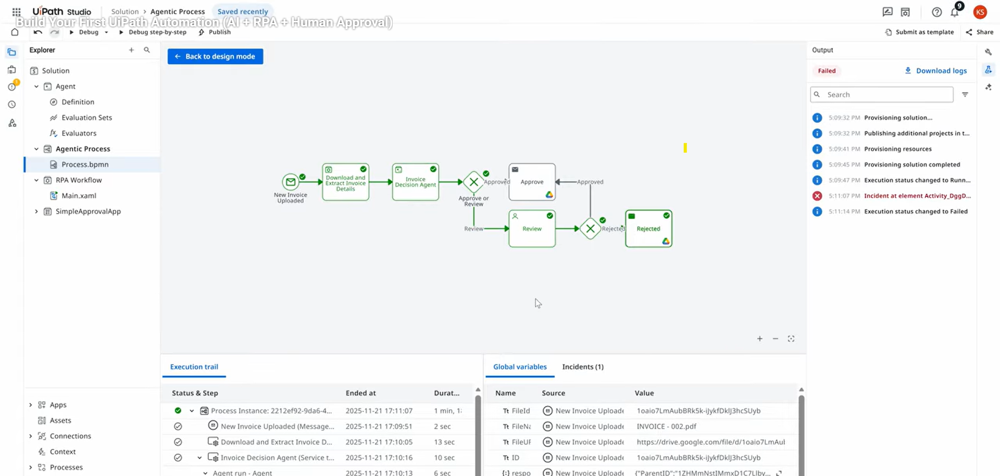
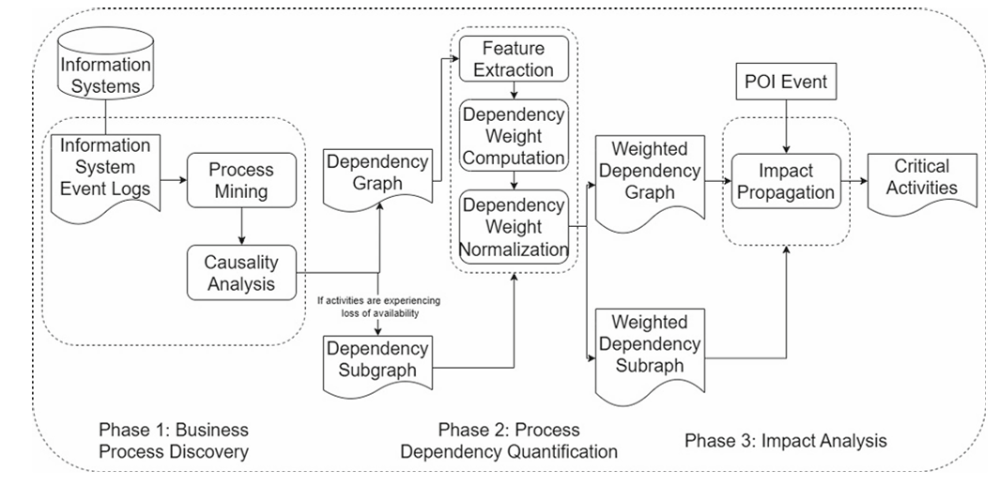
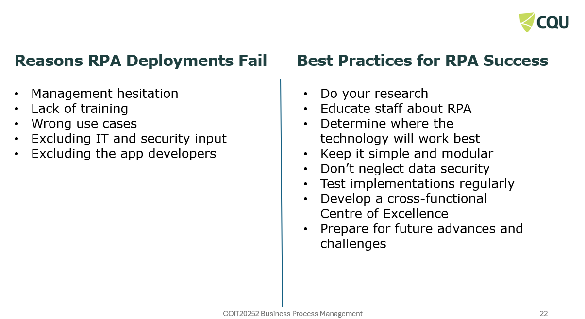
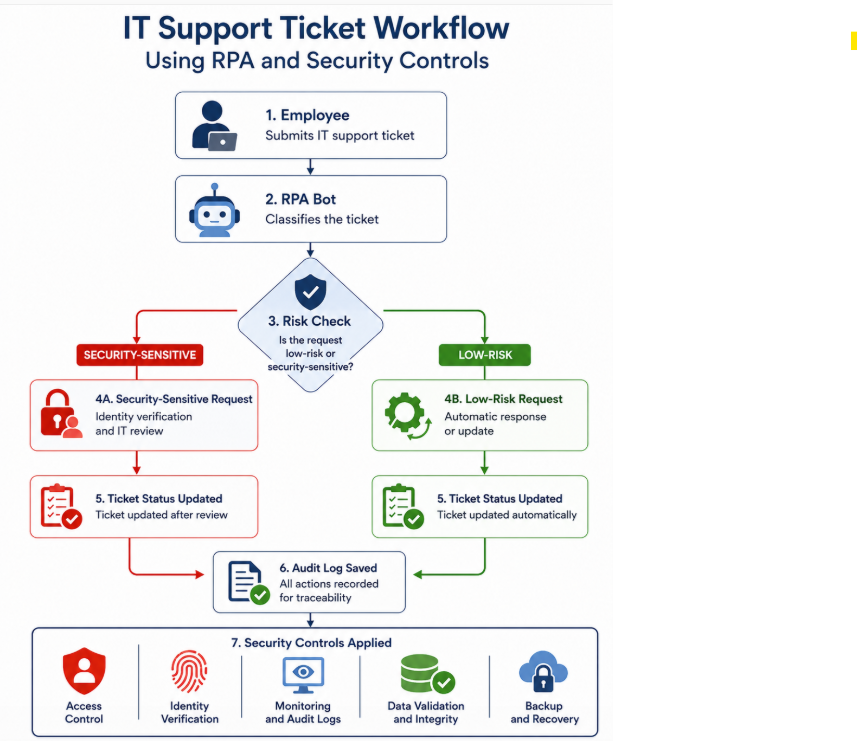

  # COIT20252 Business Process Management
  # E-Portfolio 3: Robotic Process Automation and Process Cybersecurity
  **Student Name:** Erika Macias Barragan  
  **Student ID:** 12284869

  

  ## Artefact 1: Build Your First UiPath Automation:AI + RPA + Human Approval(Video)
  **Description**
  This resource is a UiPath video demonstrating a process for automating invoice approval. The workflow includes uploading invoices, extracting data from them, an AI-based decision agent, and human approval or review before the process continues. It shows that automation works better when the business process is clear and well organised first.

***Figure 1: UiPath invoice approval workflow using RPA, AI decision support and human review.
Source: Stratvert (2026, 51:00:00).****

  
  **Reflection**
I chose this video because it helped me connect RPA with BPM in a practical way. I realised that automation is not just about speeding up tasks; it also requires a clear process map, decision points, exceptions and verification checks. The human approval step was important because it demonstrated that judgement and accountability are still necessary when AI supports business decisions. It also encouraged me to put this into practice in my personal projects.

  ## Artefact 2: Process Cybersecurity and Process Mining (Article)
  **Description**
  This artefact is a process cybersecurity figure from (Raptaki, Stergiopoulos and Gritzalis, 2025, pag 5) It shows how event logs are analysed through process mining to create dependency graphs and identify critical activities after a cybersecurity incident. 
  
  
  ***Figure 2: Methodology for process mining and cybersecurity impact analysis.
Source: Raptaki, Stergiopoulos and Gritzalis (2025, p. 5).***

  **Reflection**
 I chose this artefact because the image helped me understand cybersecurity as part of the whole business process, not only as a technical issue. The “POI Event” in the figure shows where an incident may start, while “Impact Propagation” shows how the problem can move to other connected activities. This made me realise that one cyberattack can affect more than one system or task. For BPM, this is important because a secure process must consider dependencies, risks and critical activities before a disruption happens.
 
  ## Artefact 3:Reasons RPA Deployments Fail and Best Practices for RPA Success  (Lecture)
  **Description**
This artefact is from  lecture slide on why RPA implementations may fail and how businesses can boost RPA success. (CQUniversity, 2026, p. 22).

  
  ***Figure 3: Reasons for RPA deployment failure and best practices for RPA success.
Source: CQUniversity (2026, p. 22).***

  **Reflection**
 I chose this artefact because it has given me a more realistic view of RPA. I used to assume automation was about saving time and eliminating manual work. However, the presentation showed me that RPA could fail if the process is not suitable, if people are not prepared and if security is not considered. This is connected to Artefact 2 as both show that automation and cyber security need to work together. One weak point in an automated activity in BPM might have a domino effect on other related activities. It also reminded me that businesses need to be open to change, as new technology and risks might impact on business processes on a daily basis.
 
  
 ## Artefact 4:Automated IT Support Ticket Workflow with Cybersecurity Controls (Self-developed artefact)
  **Description**
  This artefact is my personal workflow diagram describing how RPA could support an IT support ticket process. The diagram illustrates how a bot can read a ticket, classify the request, determine if it is low risk or security sensitive, update the ticket status, and save an audit log. It also includes cyber security controls such as identity verification, access restriction, monitoring and audit recording.
  
  
***Figure 4: Self-developed IT support ticket workflow using RPA and cybersecurity controls.
Source: Author’s own work, created using ChatGPT image generation.***

  **Reflection**
  I opted to develop this artefact because it helped me to integrate RPA and cybersecurity in another business process. I realised that even while automation is wonderful for simple and repetitive requests, security sensitive tasks should always be human reviewed. This relates to BPM in that a process should not just be faster, it also must be managed, traceable and safe for the organisation.

### References
CQUniversity 2026, ‘Week 8: process technologies, robotic process automation and process cybersecurity’, PowerPoint presentation, COIT20252 Business Process Management, CQUniversity, viewed 19 May 2026, http://moodle.cqu.edu.au/
Raptaki, M, Stergiopoulos, G & Gritzalis, D 2025, ‘Automated cybersecurity impact propagation across business processes using process mining techniques’, International Journal of Information Security, vol. 24, article no. 129. DOI: 10.1007/s10207-025-01040-0
Stratvert, K 2026, Build your first UiPath automation (AI + RPA + human approval), video, YouTube, viewed 20 May 2026, https://www.youtube.com/watch?v=p0AfPMV3BWw

## Evidence of Original Work Checklist

- [x] Personal reflections written in my own voice, demonstrating what I learned and how my understanding developed  
- [x] Examples tailored to my context  
- [x] Annotations and explanations linking artefacts to Business Process Management (BPM) concepts  
- [x] Citations and references included to support analysis and academic claims  
- [x] Multimedia elements created, including process diagrams and visual representations  
- [x] Screenshots or notes from my process (e.g., brainstorming or mind maps)

